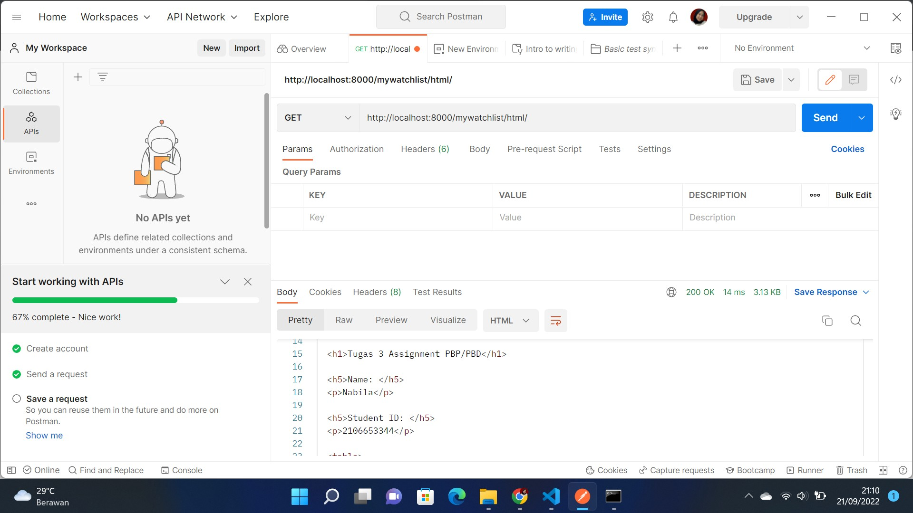
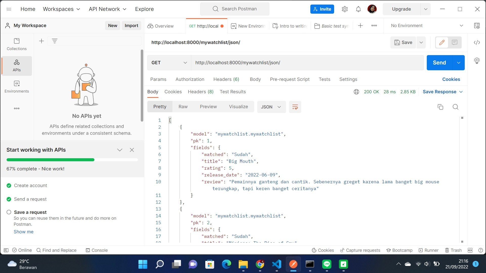
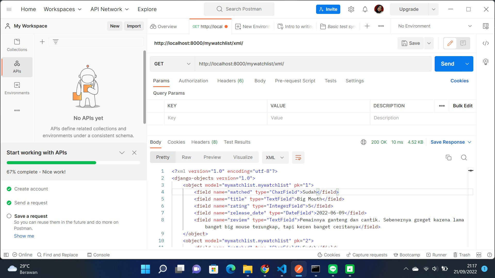

# Assignment 3 PBP

Nama : Rizka Nisrina Nabila
NPM : 2106653344
Kelas : PBP - B

# Link

Main Page : 
https://tugas2rizka.herokuapp.com/

Main Page :
https://tugas2rizka.herokuapp.com/katalog/

Mywatchlist Page :
https://tugas2rizka.herokuapp.com/mywatchlist/

# 1. Perbedaan XML, HTML, dan JSON

## XML (Extensible Markup Language)
1. Berguna untuk menyimpan data dan pertukaran data
2. Tag bersifat case sensitive
3. Data yang disimpan di-wrap oleh tag
4. Ukuran dokumen dan file besar
5. Harus menggunakan tag penutup

## HTML (Hypertext Markup Language)
1. Berguna untuk mendisplay suatu dokumen ke web browser
2. Tag bersifat insensitive
3. Data yang ingin ditampilkan di-wrap oleh tag
4. Merupakan bahasa markup standar
5. Tidak mengandung informasi strukturan

## JSON (JavaScript Obeject Notation)
1. Berguna untuk menyimpan data dan pertukaran data
2. Tidak ada tag atau data yang tidak terpakai
3. Lebih mudah digunakan sekaligus lebih cepat daripada XML saat implementasi AJAX
4. Data disimpan dalam bentuk string
5. Ukuran dokumen ringkas dan mudah dibaca

# 2. Data delivery dalam pengimplementasian sebuah platform
Data delivery dibutuhkan saat akan memindahkan data ddari satu platform ke platform lain. Data delivery bisa saja membuat terjadinya transfer data sehingga untuk aplikasi yang dikembangkan pada berbagai platform berbeda bisa mengakses data yang up-to-date pada setiap platformnya. Data tersebut dikirim dalam format HTML, XML, dan JSON.

# 3. Implementasikan checklist

- Membuat suatu aplikasi baru bernama mywatchlist dengan perintah python manage.py startapp mywatchlist

- Menambahkan path mywatchlist sehingga pengguna dapat mengakses http://localhost:8000/mywatchlist
def show_mywatchlist(request):
    return render(request, "mywatchlist.html")
from django.urls import path
from wishlist.views import show_mywatchlist

app_name = 'mywatchlist'

urlpatterns = [
    path('', show_mywatchlist, name='show_mywatchlist'),
]
Daftarkan juga aplikasi wishlist ke dalam urls.py yang ada pada folder project_django
path('mywatchlist/', include('mywatchlist.urls')),

-  Membuat sebuah model Mywatchlist
from django.db import models
class Mywatchlist(models.Model):
    watched = models.CharField(max_length=255)
    title = models.TextField()
    rating = models.IntegerField()
    release_date = models.DateField()
    review = models.TextField()

- Menambahkan 10 data untuk objek Mywatchlist contoh:
    {
        "model": "mywatchlist.Mywatchlist",
        "pk": 1,
        "fields": {
            "watched": "Sudah",
            "title": "Big Mouth",
            "rating": 5,
            "release_date": "2022-06-09",
            "review": "Pemainnya ganteng dan cantik. Sebenernya greget karena lama banget big mouse terungkap, tapi keren banget ceritanya"
        }
    },

- Membuat fungsi untuk menyajikan data yang telah dibuat sebelumnya dalam tiga format HTML, XML, JSON
def show_mywatchlist(request):
    data_mywatchlist = Mywatchlist.objects.all()
    context = {
        'watchlist' : data_mywatchlist,
        'nama': 'Nabila',
        'npm' : '2106653344'
    }
    return render(request, "mywatchlist.html", context)

def show_xml(request):
    data = Mywatchlist.objects.all()
    return HttpResponse(serializers.serialize("xml", data), content_type="application/xml")
    
- Membuat routing sehingga data di atas dapat diakses melalui URL:
urlpatterns = [
    path('', show_mywatchlist, name='show_mywatchlist'),
    path('html/', show_mywatchlist, name='show_mywatchlist'),
    path('xml/', show_xml, name='show_xml'), 
    path('json/', show_json, name='show_json'), 
    path('json/<int:id>', show_json_by_id, name='show_json_by_id'),
    path('xml/<int:id', show_xml_by_id, name='show_xml_by_id'), 
]

- Membuat folder templates mywatchlist.html untuk tempat file HTML yang akan dirender oleh method di views.py

- Membuat clas Testing yang berisi method untuk menge-test apakah url sudah work
class html_mywatchlist (TestCase):
    def test_url_exists_at_correct_location(self):
        response = self.client.get("/mywatchlist/html/")
        self.assertEqual(response.status_code, 200)
        
- Menambahkan potongan kode release: sh -c 'python manage.py migrate && python manage.py loaddata initial_mywatchlist_data.json' ke procfile
release: sh -c 'python manage.py migrate && python manage.py loaddata initial_mywatchlist_data.json'
web: gunicorn project_django.wsgi --log-file -

- Add, commit, dan push ke repository github untuk dideploy otomatis ke Django. Selesai pekerjaan sudah beres, berdoa semoga aman. :)

#  Postman

http://localhost:8000/mywatchlist/html

http://localhost:8000/mywatchlist/json

http://localhost:8000/mywatchlist/xml

